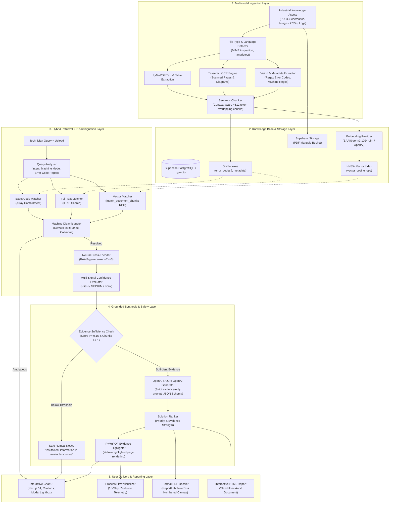
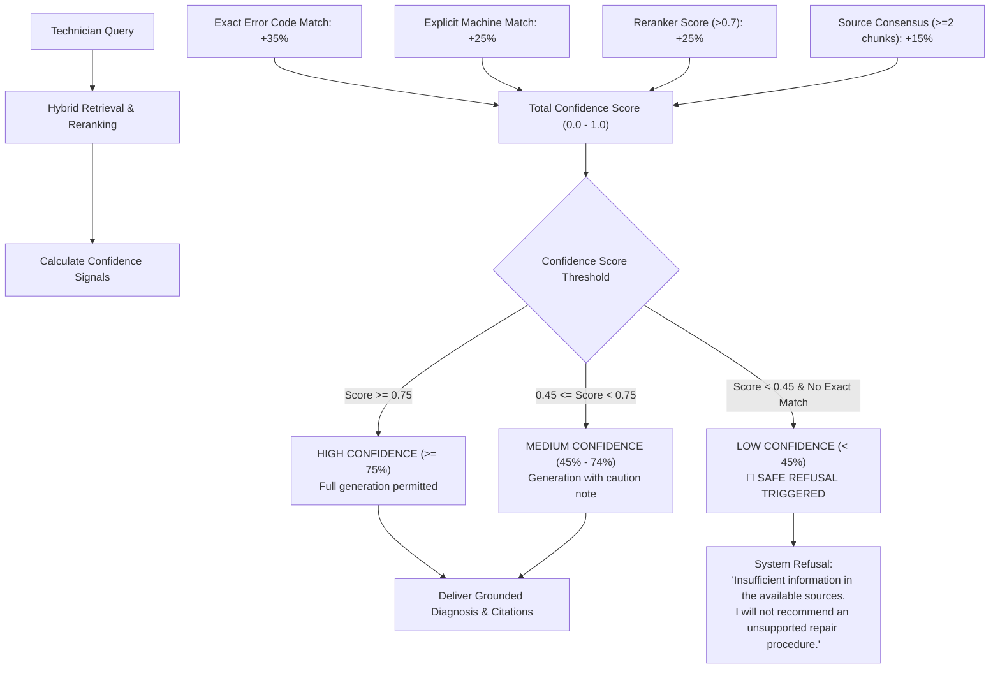

# Industrial Machine Troubleshooting System

> An enterprise-grade, RAG-powered diagnostic assistant that ingests industrial service manuals, telemetry logs, electrical schematics, and sensor tables to produce auditable, grounded repair solutions with page-level visual citations.

<div align="center">

[](https://www.docker.com/)
[](https://www.python.org/)
[](https://fastapi.tiangolo.com/)
[](https://nextjs.org/)
[](https://www.typescriptlang.org/)
[](https://www.postgresql.org/)
[](https://github.com/pgvector/pgvector)
[](https://www.sonarqube.org/)
[](https://trivy.dev/)
[](LICENSE)

</div>

---

## 📑 Table of Contents

- [Overview & The Industrial Challenge](#-overview--the-industrial-challenge)
- [The Core Philosophy](#-the-core-philosophy)
- [Features Matrix](#-features-matrix)
- [System Architecture](#-system-architecture)
- [Dual Operational Interfaces](#-dual-operational-interfaces)
- [🔬 The 16-Step Processing Pipeline](#-the-16-step-processing-pipeline)
- [⚠️ Cross-Manual Ambiguity Resolution](#️-cross-manual-ambiguity-resolution)
- [🛑 Hallucination Prevention & Multi-Signal Confidence](#-hallucination-prevention--multi-signal-confidence)
- [📚 Citation Traceability & Yellow-Highlighted Evidence](#-citation-traceability--yellow-highlighted-evidence)
- [🛡️ Code Quality & Security (SonarQube + Trivy)](#️-code-quality--security-sonarqube--trivy)
- [🌿 Git Strategy & Workflow](#-git-strategy--workflow)
- [🗄️ Database Architecture & pgvector Schema](#️-database-architecture--pgvector-schema)
- [🔌 REST API Reference](#-rest-api-reference)
- [📂 Repository Layout](#-repository-layout)
- [🚀 Quick Start & How to Run the Website](#-quick-start--how-to-run-the-website)
- [⚙️ Environment Variables Reference](#️-environment-variables-reference)

---

## ⚙️ Overview & The Industrial Challenge

Modern industrial plants deploy CNC mills, injection molders, hydraulic presses, packaging lines, and robotic arms from dozens of OEMs. When equipment faults occur on the plant floor, technicians are confronted with:

- **Cryptic Fault Codes**: Alarms such as `E101`, `ERR-42`, or `F03` that have radically different meanings across different manufacturers.
- **Vast Technical Corpora**: 800+ page PDF manuals, scanned schematics, wiring tables, sensor logs, and maintenance bulletins.
- **Multimodal Artifacts**: Critical procedural tables, hydraulic schematics, and warning placards embedded inside rasterized scans.
- **High Cost of Downtime**: Unscheduled factory downtime exceeds thousands of dollars per minute; guessing causes component damage or technician hazards.

### Why Generic "Chat with PDF" Solutions Fail in Industrial Environments

| Problem Dimension | Basic "Chat with PDF" / Keyword Search | Industrial Machine Troubleshooting System |
| :--- | :--- | :--- |
| **Error Code Collisions** | Blends conflicting manuals together, guessing symptoms. | **Disambiguation Engine** detects multi-machine collisions and prompts the technician. |
| **Hallucination Risk** | Confidently manufactures plausibly sounding torque specs or wire colors. | **Strict Evidence Gate**: Refuses to generate repair actions if evidence is missing or low-confidence. |
| **Retrieval Precision** | Vector-only search often misses short error tokens like `E101`. | **Tri-Strategy Hybrid Retrieval**: Exact regex array search + full-text keyword + pgvector cosine similarity. |
| **Verification & Auditing** | Provides no page citations or generates fake page references. | **Coordinate Evidence Highlighting**: Automatically generates yellow-highlighted PNG crops from original PDF pages. |
| **Actionability** | Unstructured narrative responses without clear hierarchy. | **Ranked Solutions & Formal Reports**: Outputs prioritized corrective actions and exports PDF/HTML diagnostic dossiers. |

---

## 🧠 The Core Philosophy

> **"We never ask the Large Language Model to guess an industrial repair solution."**

Instead of relying on generative memory, our architecture treats the LLM strictly as an **evidence synthesizer** and **structured formatter**. Every recommended step is tied to verified document chunks retrieved directly from equipment documentation.

```text
SOURCE DOCUMENTS (PDFs, Images, CSVs, Logs, TXT)
      ↓
MULTIMODAL INGESTION & OCR (PyMuPDF, Tesseract, Layout Extraction)
      ↓
STRUCTURE & METADATA NORMALIZATION (Machine Models, Error Codes, Sections)
      ↓
SEMANTIC OVERLAPPING CHUNKING (~512 tokens with context headers)
      ↓
VECTOR & KEYWORD INDEXING (1024-dim BGE-M3 / pgvector HNSW + GIN Indexes)
      ↓
TRI-STRATEGY HYBRID RETRIEVAL (Exact Code Match + Keyword ILIKE + Vector Cosine)
      ↓
CROSS-MANUAL DISAMBIGUATION (Detect collision across distinct equipment lines)
      ↓
CROSS-ENCODER RERANKING (BAAI/bge-reranker-v2-m3 semantic alignment)
      ↓
MULTI-SIGNAL EVIDENCE EVALUATION (Exact match + Rerank margin + Source consensus)
      ↓
LLM GENERATION (Strict evidence-only prompt, JSON output schema, safety warnings)
      ↓
AUDITABLE CITED DOSSIER (Yellow-highlighted PDF preview, solution rankings, PDF/HTML report)
```

---

## 🛠️ Features Matrix

| Feature | Category | Implementation Status | Technical Details |
| :--- | :--- | :---: | :--- |
| **Single & Multi-Document Upload** | Ingestion | Implemented | Batch upload of service manuals, technical bulletins, and equipment addenda. |
| **Multimodal Image & Screenshot Intake** | Ingestion | Implemented | Tesseract OCR + Vision analysis for HMI screen captures and nameplate tags. |
| **CSV Sensor & Telemetry Parsing** | Ingestion | Implemented | Structured table extraction preserving tabular sensor columns and threshold values. |
| **System Event Log Parsing** | Ingestion | Implemented | Regex timestamping and log-level extraction for machine syslog dumps. |
| **Exact Error Code Search** | Retrieval | Implemented | PostgreSQL GIN index over `document_chunks.error_codes[]` array. |
| **Dense Semantic Vector Search** | Retrieval | Implemented | 1024-dimension embeddings indexed with pgvector HNSW (`m=16, ef_construction=64`). |
| **Tri-Strategy Hybrid Retrieval** | Retrieval | Implemented | Combines exact code matching, keyword ILIKE search, and cosine distance. |
| **Machine Model Disambiguation** | Reasoning | Implemented | Detects multi-model code overlap and presents interactive selection buttons. |
| **Cross-Encoder Neural Reranking** | Retrieval | Implemented | Local `BAAI/bge-reranker-v2-m3` rescoring top candidate chunks. |
| **Multi-Signal Confidence Scoring** | Grounding | Implemented | Scores 0.0–1.0 (HIGH/MEDIUM/LOW) based on exact matches, rerank delta, and consensus. |
| **Insufficient Information Refusal** | Safety | Implemented | Explicit refusal notice when document evidence falls below minimum threshold. |
| **Safety Warning Extraction** | Safety | Implemented | Prominently banners mandatory safety precautions (LOTO, high-voltage, pressure). |
| **Visual Evidence Highlighting** | Traceability | Implemented | PyMuPDF extracts PDF page and applies yellow bounding box highlights to evidence terms. |
| **Page-Level Source Citations** | Traceability | Implemented | Every finding links to manual title, machine model, section, page, and chunk index. |
| **Corrective Solution Ranking** | Output | Implemented | Prioritizes solutions by evidence strength, invasiveness, and verification status. |
| **Formal PDF Report Generation** | Reporting | Implemented | Two-pass `ReportLab` NumberedCanvas PDF generation with audit metadata. |
| **Interactive HTML Dossier** | Reporting | Implemented | Standalone, printable HTML report with diagnostic breakdown and evidence gallery. |
| **Process Flow Inspection View** | Developer / UI | Implemented | 16-step transparent visualization exposing real-time pipeline telemetry. |
| **Light & Dark Theme Support** | UI / UX | Implemented | Modern CSS variables with instant toggle across Chatbot and Process Flow views. |
| **SonarQube Quality Gate** | CI / Quality | Implemented | Automated code smells, bugs, duplications (<3%), and security hotspot gates. |
| **Trivy Vulnerability Scanner** | Security | Implemented | Automated filesystem, secret, dependency, and container image scans. |
| **Dockerized Microservices** | DevOps | Implemented | Production-ready Docker Compose orchestration for backend and frontend services. |

---

## 🏗️ System Architecture



---

## 🖥️ Dual Operational Interfaces

The application provides two dedicated user interfaces tailored for distinct operational use cases:

```text
                                  OPERATIONAL CLIENT
                                          │
                  ┌───────────────────────┴───────────────────────┐
                  ▼                                               ▼
         💬 CHATBOT INTERFACE                          🔬 PROCESS FLOW INTERFACE
      (Target: Field Technicians)                     (Target: Engineers & Auditors)
  • Conversational natural language intake        • 16-step transparent pipeline debugger
  • Instant disambiguation selection buttons      • Live telemetry inspection at every step
  • Inline yellow evidence image modals           • Step-by-step manual or auto-play execution
  • Quick one-click PDF / HTML report downloads   • Verification of chunking, vectors, & reranking
```

---

## 🔬 The 16-Step Processing Pipeline

```text
┌────────────────────────────────────────────────────────────────────────────────────────┐
│                               16-STEP INDUSTRIAL PIPELINE                               │
├──────────────────┬─────────────────────────────────────────────────────────────────────┤
│ 1. Ingestion     │ Step 1: Input Collection (PDFs, Images, CSVs, Logs, TXT)             │
│                  │ Step 2: Language & File Type Detection                              │
│                  │ Step 3: Multimodal Extraction (PyMuPDF, Tesseract OCR, Vision)       │
│                  │ Step 4: Metadata & Schema Normalization                             │
├──────────────────┼─────────────────────────────────────────────────────────────────────┤
│ 2. Storage       │ Step 5: Semantic Intelligent Chunking (~512 token overlap)          │
│                  │ Step 6: 1024-Dim Vector Embeddings (BGE-M3 / OpenAI)                │
│                  │ Step 7: Database Ingestion (Supabase PostgreSQL + pgvector HNSW)     │
├──────────────────┼─────────────────────────────────────────────────────────────────────┤
│ 3. Retrieval     │ Step 8: User Query & Intent Understanding                           │
│                  │ Step 9: Tri-Strategy Hybrid Retrieval (Exact + Keyword + Vector)     │
│                  │ Step 10: Machine Model Disambiguation                               │
│                  │ Step 11: Cross-Encoder Neural Reranking (BGE-Reranker-v2-m3)        │
├──────────────────┼─────────────────────────────────────────────────────────────────────┤
│ 4. Grounding     │ Step 12: Evidence & Multi-Signal Confidence Evaluation              │
│                  │ Step 13: Context Assembly & Excerpt Formatting                      │
│                  │ Step 14: LLM Evidence Synthesis (Strict Evidence Prompt)            │
├──────────────────┼─────────────────────────────────────────────────────────────────────┤
│ 5. Output        │ Step 15: Visual Evidence Highlighting (PyMuPDF Yellow Highlights)   │
│                  │ Step 16: Corrective Solution Ranking & Report Dossier Generation     │
└──────────────────┴─────────────────────────────────────────────────────────────────────┘
```

---

## ⚠️ Cross-Manual Ambiguity Resolution

In industrial manufacturing, the same error code often denotes completely different physical malfunctions on different machine models.

### The Collision Scenario
- **Machine A (`CNC-X100`)**: Error `E101` indicates **"Spindle Servo Overheating / Thermal Overload"**.
- **Machine B (`PRESS-V200`)**: Error `E101` indicates **"Hydraulic System Low Pressure / Accumulator Fault"**.

If a technician asks *"What does error E101 mean?"*, the disambiguation engine prompts the operator:

```text
TECHNICIAN QUERY: "What does error E101 mean?"
                           │
                           ▼
               DETECT ERROR CODE: "E101"
                           │
                           ▼
          SCAN RETRIEVED CANDIDATE CHUNKS
            ├── CNC-X100 Service Manual (Section: Spindle Drive)
            └── PRESS-V200 Service Manual (Section: Hydraulics)
                           │
                           ▼
     ⚠️ COLLISION DETECTED: [CNC-X100, PRESS-V200]
                           │
                           ▼
             INTERACTIVE DISAMBIGUATION PROMPT
   "Error code E101 was detected in service manuals for multiple
    machines (CNC-X100, PRESS-V200). Please select your machine:"
                           │
         ┌─────────────────┴─────────────────┐
         ▼                                   ▼
 [ Model: CNC-X100 → ]               [ Model: PRESS-V200 → ]
```

---

## 🛑 Hallucination Prevention & Multi-Signal Confidence



---

## 📚 Citation Traceability & Yellow-Highlighted Evidence

```text
┌─────────────────────────────────────────────────────────────┐
│ Manual: CNC-X100 Milling Center Maintenance Manual          │
│ Section: Spindle Drive Alarms                 Page: 214     │
├─────────────────────────────────────────────────────────────┤
│ 4.2 Spindle Thermal Overload (Alarm E101)                   │
│                                                             │
│ When Alarm E101 appears on the primary operator panel,      │
│ the thermal sensor inside the spindle motor winding has     │
│ exceeded 115°C.                                             │
│                                                             │
│ 🟨 CAUTION: DISCONNECT MAIN BREAKER BEFORE INSPECTION. 🟨   │
│                                                             │
│ Recommended Corrective Action:                              │
│ 🟨 1. Inspect heat exchanger cooling fan for debris.   🟨   │
│ 🟨 2. Verify coolant flow rate is greater than 15 L/min.🟨   │
└─────────────────────────────────────────────────────────────┘
```

---

## 🛡️ Code Quality & Security (SonarQube + Trivy)

### SonarQube Code Quality Analysis
Configured via [`sonar-project.properties`](file:///Users/darshanpatil/Downloads/Vcet/sonar-project.properties):
- **Quality Gate Criteria**: 0 Blocker/Critical bugs, Cognitive Complexity < 15 per function, Code duplication < 3%.
- **Multilingual Analysis**: Python 3.11 backend and Next.js / TypeScript frontend.

### Trivy Security Scanning
Configured via [`trivy.yaml`](file:///Users/darshanpatil/Downloads/Vcet/trivy.yaml):
- **Filesystem & Dependency Audit**: Scans Python and Node dependencies against CVE databases.
- **Container Vulnerability Scan**: Assesses Docker base images for critical security vulnerabilities.
- **Secret & Misconfiguration Detection**: Prevents accidental commits of API keys or open permissions.

---

## 🌿 Git Strategy & Workflow

### Branching Model
- `main`: Production-ready, verified releases. Protected branch.
- `develop`: Integration branch for tested features.
- `feat/<issue-id>-<description>`: Topic branches for new capabilities.
- `fix/<issue-id>-<description>`: Maintenance and bug fixes.

### Commit Conventions (Conventional Commits)
```bash
feat(rag): add cross-encoder neural reranking via bge-reranker-v2-m3
fix(ingestion): resolve OCR encoding for scanned German equipment manuals
docs(readme): add architecture diagram and 16-step process pipeline
sec(ci): integrate Trivy vulnerability scanner and SonarQube quality gate
```

---

## 🗄️ Database Architecture & pgvector Schema

Housed in Supabase PostgreSQL, defined in [`database/schema.sql`](file:///Users/darshanpatil/Downloads/Vcet/database/schema.sql):

- **Vector Cosine Index**:
  ```sql
  CREATE INDEX idx_chunks_embedding ON document_chunks
  USING hnsw (embedding vector_cosine_ops)
  WITH (m = 16, ef_construction = 64);
  ```
- **Error Code GIN Index**:
  ```sql
  CREATE INDEX idx_chunks_error_codes ON document_chunks USING GIN(error_codes);
  ```

---

## 🔌 REST API Reference

| Method | Endpoint | Description |
| :--- | :--- | :--- |
| `GET` | `/health` | Service health status check. |
| `GET` | `/api/machines` | List registered machine models. |
| `POST` | `/api/upload/knowledge` | Universal multi-format upload (PDF, Image, CSV, Log, TXT). |
| `POST` | `/api/rag/query` | Primary troubleshooting RAG endpoint. |
| `POST` | `/api/process-flow/upload` | Upload files to a specific process flow session. |
| `POST` | `/api/process-flow/{sid}/step/{num}` | Execute specific step (1–16) in Process Flow. |
| `POST` | `/api/reports/generate` | Generate PDF and HTML reports. |
| `GET` | `/api/reports/{id}/pdf` | Download formal PDF report. |
| `GET` | `/api/evidence/{filename}` | Serve yellow-highlighted source page screenshot. |

---

## 🚀 Quick Start & How to Run the Website

### Option A: Run Directly on Your Mac (Fastest & Easiest)

Bypasses Docker completely so you can run and test immediately:

#### 1. Start the Backend API (FastAPI)
```bash
cd backend

# Create & activate virtual environment
python3.11 -m venv venv
source venv/bin/activate

# Install dependencies
pip install -r requirements.txt

# Start backend server on port 8000
uvicorn app.main:app --host 0.0.0.0 --port 8000 --reload
```

#### 2. Start the Frontend Website (Next.js)
Open a new terminal window:
```bash
cd frontend

# Install packages
npm install

# Start Next.js development server
npm run dev
```

Visit the website at: **[http://localhost:3000](http://localhost:3000)**

---

### Option B: Run via Docker Compose (Colima Fix Included)

If your Colima / Docker container storage was corrupted by the full disk, reset Colima first:

```bash
# 1. Restart Colima with clean state
colima stop
colima start --cpu 4 --memory 8

# 2. Build without corrupted cache and start
docker compose build --no-cache
docker compose up -d
```

Access:
- **Technician Chatbot**: [http://localhost:3000/chat](http://localhost:3000/chat)
- **16-Step Process Flow**: [http://localhost:3000/process-flow](http://localhost:3000/process-flow)
- **API Swagger Docs**: [http://localhost:8000/docs](http://localhost:8000/docs)

---

## ⚙️ Environment Variables Reference

| Variable | Required | Default | Description |
| :--- | :---: | :--- | :--- |
| `OPENAI_API_KEY` | Optional* | `""` | Direct OpenAI API key for GPT-4o synthesis. |
| `AZURE_OPENAI_ENDPOINT` | Optional* | `""` | Azure OpenAI resource endpoint. |
| `AZURE_OPENAI_KEY` | Optional* | `""` | Azure OpenAI API key. |
| `SUPABASE_URL` | **Yes** | `""` | URL of your Supabase project instance. |
| `SUPABASE_KEY` | **Yes** | `""` | Supabase anon or service-role API key. |
| `EMBEDDING_PROVIDER` | No | `local` | `local` (BAAI/bge-m3) or `openai`. |
| `RERANKER_MODEL` | No | `BAAI/bge-reranker-v2-m3` | Cross-encoder model for neural reranking. |
| `NEXT_PUBLIC_API_URL` | No | `http://localhost:8000` | Backend API URL used by the Next.js client. |
